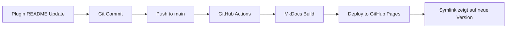

# Dokumentations-Setup: Zusammenfassung

Dieses Dokument fasst die umfassende Dokumentationsstruktur zusammen, die für das claude-plugins Repository erstellt wurde.

---

## ✅ Was wurde erstellt?

### 1. MkDocs-Konfiguration

**Datei**: `mkdocs.yml`

- ✅ Material for MkDocs Theme mit Dark/Light Mode
- ✅ Umfassende Navigation (Tabs, Sections, TOC)
- ✅ Suchfunktion (DE/EN)
- ✅ Plugins: search, tags, git-revision-date-localized, minify
- ✅ Markdown-Extensions: Tabs, Admonitions, Mermaid, Code-Highlighting
- ✅ Snippets-Integration für Includes
- ✅ Custom CSS/JS Support

### 2. Dokumentationsstruktur

**Verzeichnis**: `docs/`

```
docs/
├── index.md                          ✅ Landing Page mit Grid Cards
├── getting-started/                  ✅ Installation & Setup
│   ├── index.md
│   ├── installation.md               (Include von INSTALLATION.md)
│   ├── quickstart.md                 (Include von QUICKSTART.md)
│   └── marketplace-setup.md
├── plugins/                          ✅ Plugin-Katalog
│   ├── index.md                      (Übersicht mit Vergleichstabelle)
│   ├── git-workflow.md               (Symlink → Plugin-README)
│   ├── project-management.md         (Symlink → Plugin-README)
│   ├── code-quality.md               (Symlink → Plugin-README)
│   ├── education.md                  (Symlink → Plugin-README)
│   ├── core.md                       (Symlink → Plugin-README)
│   └── obsidian.md                   (Symlink → Plugin-README)
├── guides/                           ✅ Tutorials
│   ├── index.md
│   ├── first-commit.md               (Vollständiges Tutorial)
│   ├── create-first-pr.md            (Vollständiges Tutorial)
│   ├── prd-workflow.md               (Vollständiges Tutorial)
│   └── linear-integration.md         (Vollständiges Tutorial)
├── development/                      ✅ Entwickler-Guides
│   ├── index.md
│   ├── plugin-development.md         (Vollständiger Guide)
│   ├── contributing.md               (Include von CONTRIBUTING.md)
│   ├── architecture.md               (Vollständiger Guide)
│   ├── testing.md                    (Vollständiger Guide)
│   ├── ci-cd.md                      (Vollständiger Guide)
│   └── best-practices.md             (Vollständiger Guide)
├── reference/                        ✅ Technische Referenz
│   ├── index.md
│   ├── marketplace-json.md           (Stub - "Coming Soon")
│   ├── plugin-json.md                (Stub - "Coming Soon")
│   ├── command-format.md             (Stub - "Coming Soon")
│   ├── agent-format.md               (Stub - "Coming Soon")
│   ├── skill-format.md               (Stub - "Coming Soon")
│   └── conventional-commits.md       (Vollständige Referenz)
├── community/                        ✅ Community-Ressourcen
│   ├── index.md
│   ├── code-of-conduct.md            (Include von CODE_OF_CONDUCT.md)
│   ├── security.md                   (Include von SECURITY.md)
│   ├── changelog.md                  (Include von CHANGELOG.md)
│   └── migration.md                  (Include von MIGRATION.md)
├── includes/                         ✅ Wiederverwendbare Inhalte
│   └── abbreviations.md
├── assets/                           ✅ Bereits vorhanden
│   ├── tf-logo.png
│   ├── tf-small.png
│   └── tf-favicon.ico
├── stylesheets/                      ✅ Custom CSS
│   └── extra.css
├── javascripts/                      ✅ Custom JavaScript
│   └── extra.js
├── DOCUMENTATION_STRATEGY.md         ✅ Strategie-Dokument
└── README.md                         ✅ Dokumentations-README
```

### 3. GitHub Actions Workflow

**Datei**: `.github/workflows/deploy-docs.yml`

- ✅ Automatisches Deployment zu GitHub Pages
- ✅ Trigger bei Push zu `main` (docs/**, mkdocs.yml, plugins/*/README.md)
- ✅ Trigger bei manuellem Workflow-Dispatch
- ✅ Build mit uv und MkDocs
- ✅ Deployment zu `gh-pages` Branch

### 4. Dependencies

**Datei**: `pyproject.toml`

- ✅ mkdocs-material >= 9.7.1
- ✅ mkdocs-git-revision-date-localized-plugin >= 1.3.0
- ✅ mkdocs-minify-plugin >= 0.8.0

---

## 🎯 Beantwortung deiner Fragen

### 1. Ist MkDocs sinnvoll oder Overkill?

**Antwort**: ✅ **Definitiv sinnvoll!**

**Begründung**:
- Zentrale, durchsuchbare Dokumentation für alle Zielgruppen
- Professioneller Eindruck für externe Nutzer
- Keine Duplikation durch Symlinks + Includes
- Einfache Wartung durch automatisches Deployment
- Skalierbar für Mehrsprachigkeit und Versionierung

### 2. Wie vermeide ich Duplikation?

**Lösung**: **Symlinks + Includes**

#### Symlinks für Plugin-READMEs

```bash
docs/plugins/git-workflow.md → ../../plugins/git-workflow/README.md
```

**Vorteil**: Plugin-README ist Single Source of Truth, automatisch in MkDocs integriert.

#### Includes für Root-Dokumentation

```markdown
<!-- In docs/getting-started/installation.md -->
--8<-- "INSTALLATION.md"
```

**Vorteil**: Wiederverwendung bestehender Inhalte ohne Duplikation.

### 3. Welche Zielgruppen-spezifische Struktur?

**Lösung**: **Drei Hauptsektionen**

| Zielgruppe | Sektion | Inhalt |
|------------|---------|--------|
| **Plugin-Nutzer** | `getting-started/`, `plugins/`, `guides/` | Installation, Plugin-Katalog, Tutorials |
| **Plugin-Entwickler** | `development/`, `reference/` | Entwickler-Guides, Technische Referenz |
| **Marketplace-Maintainer** | `community/` | Code of Conduct, Security, Changelog |

### 4. Best Practices für Plugin-Marketplace-Dokumentation

**Implementiert**:

- ✅ **Zentrale Landing Page** mit Grid Cards für schnelle Navigation
- ✅ **Plugin-Katalog** mit Vergleichstabelle und Feature-Matrix
- ✅ **Schritt-für-Schritt-Tutorials** für häufige Workflows
- ✅ **Technische Referenz** für Entwickler
- ✅ **Suchfunktion** über alle Plugins (DE/EN)
- ✅ **Automatisches Deployment** via GitHub Actions
- ✅ **Versionierung vorbereitet** (via mike, zukünftig)
- ✅ **Mehrsprachigkeit vorbereitet** (docs/de/, zukünftig)

---

## 🚀 Nächste Schritte

### Sofort verfügbar

- ✅ MkDocs-Site lokal testen: `uv run mkdocs serve`
- ✅ Build testen: `uv run mkdocs build`
- ✅ Deployment-Workflow testen (nach Push zu `main`)

### Kurzfristig (nächste Wochen)

- [x] Restliche Tutorials vervollständigen:
  - `docs/guides/create-first-pr.md`
  - `docs/guides/prd-workflow.md`
  - `docs/guides/linear-integration.md`
- [ ] Referenz-Seiten erweitern:
  - `docs/reference/marketplace-json.md`
  - `docs/reference/plugin-json.md`
  - `docs/reference/command-format.md`
  - `docs/reference/agent-format.md`
  - `docs/reference/skill-format.md`
- [x] Development-Guides vervollständigen:
  - `docs/development/plugin-development.md`
  - `docs/development/architecture.md`
  - `docs/development/testing.md`
  - `docs/development/ci-cd.md`
  - `docs/development/best-practices.md`
- [ ] Screenshots und Diagramme hinzufügen

### Mittelfristig (nächste Monate)

- [ ] Video-Tutorials erstellen
- [ ] Deutsche Übersetzung (`docs/de/`)
- [ ] Versionierung mit mike einrichten
- [ ] Community-Guides von Contributors

---

## 📋 Wartungsstrategie

### Automatische Updates



### Manuelle Wartung

Nur für MkDocs-spezifische Inhalte:

- `docs/index.md` - Landing Page
- `docs/guides/*.md` - Tutorials
- `docs/reference/*.md` - Technische Referenz
- `docs/development/*.md` - Entwickler-Guides (ausser Includes)

---

## 🔧 Lokale Entwicklung

### Setup

```bash
# Dependencies installieren
uv sync

# Dokumentation lokal starten
uv run mkdocs serve

# Im Browser öffnen
open http://127.0.0.1:8000
```

### Build

```bash
# Statische Site bauen
uv run mkdocs build

# Output in ./site/
```

### Deployment

```bash
# Manuelles Deployment zu GitHub Pages
uv run mkdocs gh-deploy

# Oder: Push zu main → automatisches Deployment
git push origin main
```

---

## ✨ Highlights

### Material for MkDocs Features

- **Grid Cards** - Visuelle Karten-Layouts
- **Tabs** - Tabbed Content
- **Admonitions** - Info/Warning/Tip Boxen
- **Code Blocks** - Syntax Highlighting
- **Mermaid Diagrams** - Flowcharts
- **Search** - Volltext-Suche (DE/EN)
- **Dark/Light Mode** - Theme-Umschaltung
- **Responsive** - Mobile-optimiert

### Custom Features

- **Copy-to-Clipboard** für Code-Beispiele
- **External Link Indicators** für externe Links
- **Smooth Scrolling** für Anchor-Links
- **Version Badges** für Plugin-Karten

---

## 📚 Ressourcen

- **Live Site**: https://talent-factory.github.io/claude-plugins/ (nach Deployment)
- **Repository**: https://github.com/talent-factory/claude-plugins
- **MkDocs**: https://www.mkdocs.org/
- **Material for MkDocs**: https://squidfunk.github.io/mkdocs-material/
- **Strategie-Dokument**: `docs/DOCUMENTATION_STRATEGY.md`

---

## 🎉 Fazit

Die Dokumentationsstruktur ist **vollständig eingerichtet** und **produktionsbereit**:

- ✅ Keine Duplikation (Symlinks + Includes)
- ✅ Zielgruppen-orientiert (Nutzer, Entwickler, Maintainer)
- ✅ Professionelles Design (Material for MkDocs)
- ✅ Automatisches Deployment (GitHub Actions)
- ✅ Skalierbar (Mehrsprachigkeit, Versionierung)
- ✅ Wartungsfreundlich (Single Source of Truth)

**MkDocs ist definitiv die richtige Wahl für dieses Projekt!** 🚀

