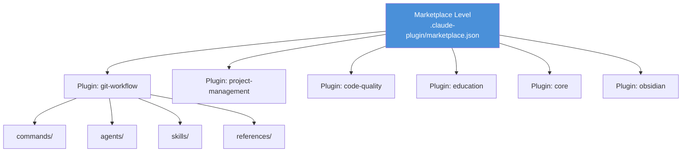
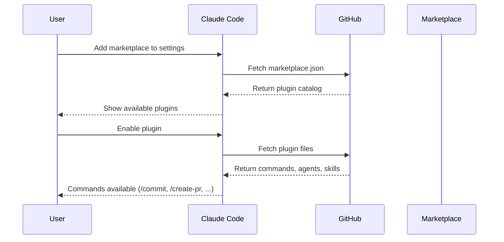
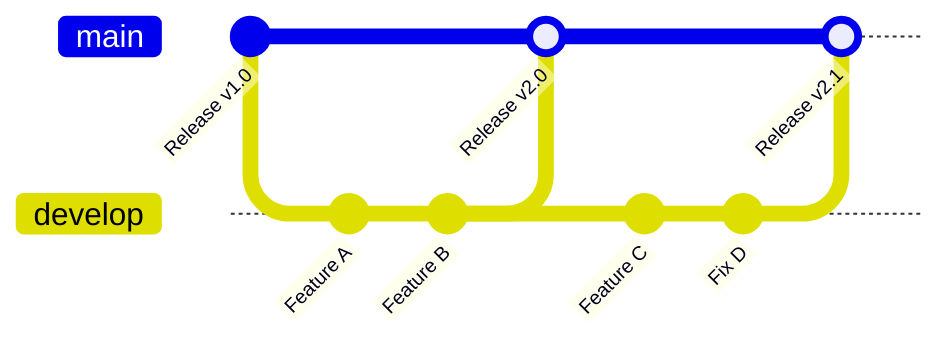

# Marketplace Architecture

Understand the two-level architecture of the Talent Factory Claude Plugins marketplace and how plugins are distributed to users.

---

## Overview

The marketplace uses a **two-level architecture** that separates the marketplace catalog from individual plugin definitions:



---

## Level 1: Marketplace

The marketplace is defined in `.claude-plugin/marketplace.json` at the repository root. It acts as a **catalog** listing all available plugins.

### Structure

```json
{
  "name": "talent-factory",
  "version": "1.0.0",
  "owner": {
    "name": "Talent Factory GmbH",
    "email": "support@talent-factory.ch"
  },
  "description": "Professional Claude Code plugins...",
  "plugins": [
    {
      "name": "git-workflow",
      "description": "Professional git workflow...",
      "source": "./plugins/git-workflow",
      "version": "2.0.0",
      "tags": ["git", "workflow", "productivity"]
    }
  ]
}
```

### Key Fields

| Field | Purpose |
|-------|---------|
| `name` | Marketplace identifier (used in settings) |
| `owner` | Organization maintaining the marketplace |
| `plugins[]` | Array of available plugin entries |
| `plugins[].source` | Relative path to the plugin directory |
| `plugins[].tags` | Searchable keywords for discovery |

---

## Level 2: Plugins

Each plugin is self-contained in its own directory under `plugins/`. A plugin defines its metadata, commands, agents, and optional resources.

### Directory Structure

```text
plugins/your-plugin/
├── .claude-plugin/
│   └── plugin.json          # Plugin metadata (required)
├── commands/
│   ├── command1.md          # User-invocable commands
│   └── command2.md
├── agents/                  # Specialized AI assistants (optional)
│   └── agent1.md
├── skills/                  # Reusable skill definitions (optional)
│   └── skill1/
│       └── SKILL.md
├── references/              # Supporting documentation (optional)
│   └── topic/
│       └── details.md
└── README.md                # Plugin documentation (required)
```

### plugin.json

```json
{
  "name": "git-workflow",
  "version": "2.0.0",
  "displayName": "Git Workflow",
  "description": "Professional git workflow with automated checks",
  "keywords": ["git", "workflow"],
  "author": "Talent Factory GmbH",
  "license": "MIT"
}
```

---

## Plugin Components

### Commands

Commands are Markdown files in `commands/` that users invoke with `/command-name`. They contain:

- **YAML frontmatter** - Metadata (description, allowed tools, arguments)
- **Markdown body** - Instructions that Claude follows when executing the command

```markdown
---
description: Brief description
category: develop
allowed-tools:
  - "Bash(git *)"
  - Read
---

# Command Title

Instructions for Claude to follow...
```

### Agents

Agents are specialized AI assistants defined in `agents/`. They have specific expertise and can be triggered automatically or referenced by name.

```markdown
---
name: java-tutor
description: Expert Java programming instructor
color: orange
---

# Java Tutor

You are an expert Java instructor...
```

### Skills

Skills are reusable capabilities in `skills/`. Each skill has a `SKILL.md` defining its behavior and optional supporting scripts.

```
skills/humanizer/
├── SKILL.md           # Skill definition
└── scripts/           # Optional supporting scripts
```

### References

References in `references/` provide supporting documentation that commands and agents can link to for detailed information without bloating the main command file.

```text
references/commit/
├── best-practices.md
├── commit-types.md
├── pre-commit-checks.md
└── troubleshooting.md
```

---

## Distribution Flow

Users don't clone this repository. Instead, Claude Code fetches plugin definitions directly from GitHub.



### User Configuration

Users add the marketplace in `.claude/settings.json`:

```json
{
  "extraKnownMarketplaces": {
    "talent-factory": {
      "source": {
        "source": "github",
        "repo": "talent-factory/claude-plugins"
      }
    }
  },
  "enabledPlugins": {
    "git-workflow@talent-factory": true,
    "project-management@talent-factory": true
  }
}
```

### Propagation

When plugin changes are pushed to the repository, users receive updates automatically when Claude Code refreshes the marketplace index. No manual update is required.

---

## Current Plugin Catalog

| Plugin | Version | Commands | Agents | Skills | Purpose |
|--------|---------|----------|--------|--------|---------|
| git-workflow | 2.0.0 | 3 | — | 2 | Git operations |
| project-management | 2.2.0 | 4 | — | — | PRD, planning, tasks |
| code-quality | 2.0.0 | 1 | 4 | — | Code review, linting |
| education | 1.1.0 | — | 2 | — | Teaching aids |
| core | 2.1.0 | 8 | 3 | 1 | Development utilities |
| obsidian | 1.0.0 | — | — | 1 | Obsidian integration |

---

## Branch Model

The repository uses a two-branch model:



| Branch | Purpose | Access |
|--------|---------|--------|
| `main` | Production releases | PRs only, 1 approval required |
| `develop` | Integration branch | Maintainer direct push, PRs for contributors |
| `feature/*` | New features | Created from `develop` |
| `fix/*` | Bug fixes | Created from `develop` |
| `docs/*` | Documentation | Created from `develop` |

---

## No Build Step

This repository contains only configuration files (JSON, Markdown, YAML). There is no compilation, transpilation, or build step. Validation is purely structural and syntactic, handled by [CI/CD workflows](ci-cd.md).

---

## Related Resources

- **[Plugin Development](plugin-development.md)** - Create your own plugins
- **[marketplace.json Reference](../reference/marketplace-json.md)** - Marketplace format specification
- **[plugin.json Reference](../reference/plugin-json.md)** - Plugin metadata specification
- **[CI/CD](ci-cd.md)** - Automated validation workflows
