# CI/CD Workflows

Understand the automated validation and deployment pipelines that ensure plugin quality and documentation availability.

---

## Overview

The repository uses four GitHub Actions workflows:

| Workflow | Trigger | Purpose |
|----------|---------|---------|
| `validate-plugins.yml` | PR/Push to main/develop | Validates plugin structure and quality |
| `branch-protection.yml` | PR to main/develop | Enforces development standards |
| `deploy-docs.yml` | Push to main | Deploys documentation to GitHub Pages |
| `pr-labels.yml` | PR events | Auto-labels PRs by type and size |

---

## Validate Plugins

**File**: `.github/workflows/validate-plugins.yml`
**Trigger**: PR or push to `main`/`develop` (when `plugins/**` changes)

This is the main validation pipeline. It runs four jobs in parallel:

```mermaid
graph TD
    A["validate-plugins.yml"] --> B["validate-structure"]
    A --> C["validate-documentation"]
    A --> D["security-scan"]
    A --> E["test-plugins"]
    B --> F["summary"]
    C --> F
    D --> F
    E --> F
    F --> G{All passed?}
    G -->|Yes| H["✅ PR can merge"]
    G -->|No| I["❌ PR blocked"]
```



### Job: validate-structure

Checks the structural integrity of all plugins:

| Check | Validates |
|-------|-----------|
| JSON syntax | `plugin.json` is valid JSON |
| Required fields | `name` and `version` exist in `plugin.json` |
| Directory structure | `.claude-plugin/plugin.json` and `README.md` exist |
| Command files | Not empty, YAML frontmatter present |
| Agent files | Not empty, YAML frontmatter present |

**Example output**:

```
Checking plugins/git-workflow/.claude-plugin/plugin.json
✅ Valid: plugin.json (name: git-workflow, version: 2.0.0)

Checking plugins/git-workflow/commands/commit.md
✅ Valid command: commit.md
```

### Job: validate-documentation

Ensures documentation quality:

- Verifies every plugin has a `README.md`
- Checks that README files contain sections (headers)
- Runs markdown link validation (broken link detection)

### Job: security-scan

Scans for security issues:

- **Trivy** filesystem scan for HIGH/CRITICAL vulnerabilities
- Pattern-based secret detection (API keys, passwords, secrets)
- Scans all files under `plugins/`

!!! warning "Secret Detection"
    The security scan checks for patterns like `api_key = "..."` or `password = "..."`. Never commit real credentials to plugin files.

### Job: test-plugins

Validates plugin loading capability:

- Verifies each plugin directory can be loaded
- Checks structural prerequisites for Claude Code compatibility

### Job: summary

Aggregates results from all jobs:

- Reports status of each validation job
- **Fails the pipeline** if structure, documentation, or plugin tests fail
- Security scan failures are logged but don't block merging

---

## Branch Protection

**File**: `.github/workflows/branch-protection.yml`
**Trigger**: PR to `main` or `develop`

Enforces development standards for all pull requests.

### Checks Performed

#### Branch Naming Validation

For PRs to `develop`, the source branch must use one of these prefixes:

| Prefix | Purpose |
|--------|---------|
| `feature/` | New features |
| `fix/` | Bug fixes |
| `docs/` | Documentation changes |
| `refactor/` | Code refactoring |
| `test/` | Test additions |
| `chore/` | Maintenance tasks |

!!! note "Exception"
    `develop → main` PRs (release PRs) are exempt from branch naming rules.

#### Commit Message Validation

Checks that commits follow the **Emoji Conventional Commits** format:

```
<emoji> <type>(<optional scope>): <description>
```

**Accepted types**: `feat`, `fix`, `docs`, `style`, `refactor`, `test`, `chore`, `perf`, `ci`, `build`, `revert`, `security`, `i18n`, `a11y`, `deps`

**Skipped**: Merge commits and release commits are ignored.

**Examples**:

```
✅ ✨ feat: Füge Benutzer-Dashboard hinzu
✅ 🐛 fix(auth): Behebe Login-Fehler
✅ 📚 docs: Aktualisiere README
✅ Merge branch 'main' into develop   (skipped)
```

#### PR Description Check

Warns if the PR description is shorter than 50 characters. Encourages detailed descriptions with:

- What changes were made
- Why the changes were necessary
- How the changes were tested

#### PR Size Validation

Warns if a PR has more than 1,000 changes. Suggests breaking large PRs into smaller, focused ones.

#### Approval Requirements

Both `main` and `develop` require at least 1 approval before merging.

---

## Deploy Documentation

**File**: `.github/workflows/deploy-docs.yml`
**Trigger**: Push to `main` (specific paths) or manual dispatch

Automatically builds and deploys documentation to GitHub Pages.

### Trigger Paths

The workflow runs when these files change on `main`:

- `docs/**` - Any documentation file
- `mkdocs.yml` - MkDocs configuration
- `plugins/*/README.md` - Plugin READMEs (used via symlinks)
- `.github/workflows/deploy-docs.yml` - The workflow itself

### Build Process


1. **Checkout** with full git history (needed for `git-revision-date-localized` plugin)
2. **Install** Python 3.13.1 and uv package manager
3. **Sync** dependencies from `pyproject.toml`
4. **Build and deploy** using `mkdocs gh-deploy --force --clean`
5. **Summary** with deployment URL and commit reference

### Manual Deployment

Trigger a deployment manually from the GitHub Actions UI using **workflow_dispatch**.

---

## PR Labels

**File**: `.github/workflows/pr-labels.yml`
**Trigger**: PR events

Automatically labels PRs based on content:

### By Changed Files

| Label | Files |
|-------|-------|
| `plugin:git-workflow` | `plugins/git-workflow/**` |
| `plugin:project-management` | `plugins/project-management/**` |
| `plugin:code-quality` | `plugins/code-quality/**` |
| `plugin:education` | `plugins/education/**` |
| `plugin:core` | `plugins/core/**` |
| `documentation` | `docs/**`, `*.md` |
| `infrastructure` | `.github/**` |

### By PR Size

| Label | Changes |
|-------|---------|
| `size/xs` | < 10 changes |
| `size/s` | 10-50 changes |
| `size/m` | 50-200 changes |
| `size/l` | 200-1000 changes |
| `size/xl` | > 1000 changes |

### By Commit Type

| Label | Commit Prefix |
|-------|---------------|
| `enhancement` | `feat` |
| `bug` | `fix` |
| `refactoring` | `refactor` |

---

## Other Workflows

### Greetings (`greetings.yml`)

Welcomes first-time contributors automatically when they open their first issue or PR.

### Stale (`stale.yml`)

Manages inactive issues and PRs:

- **Issues**: Marked stale after 60 days of inactivity, closed after 7 more days
- **PRs**: Marked stale after 30 days of inactivity, closed after 7 more days

---

## Running CI Locally

You can simulate CI checks locally using the core plugin:

```bash
# Load the core plugin
claude --plugin-dir ./plugins/core

# Run validation
/check-commands
/check-agents
/run-ci
```

Or run checks manually:

```bash
# Validate JSON files
find plugins -name "plugin.json" -exec jq empty {} \;

# Check directory structure
for dir in plugins/*/; do
  test -f "$dir/.claude-plugin/plugin.json" && echo "✅ $dir" || echo "❌ $dir"
done

# Build documentation
uv run mkdocs build --strict
```

---

## Related Resources

- **[Testing](testing.md)** - Test plugins locally
- **[Contributing](contributing.md)** - Submission workflow
- **[Architecture](architecture.md)** - Repository structure
- **[Best Practices](best-practices.md)** - Quality guidelines
