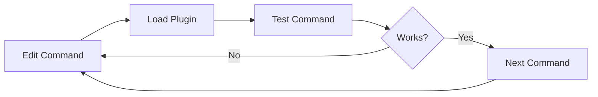

# Testing Plugins

Learn how to test your plugins locally before submitting them to the marketplace.

---

## Overview

Since plugins consist of Markdown and JSON files with no build step, testing focuses on:

1. **Structural validation** - Correct directory layout and required files
2. **Content validation** - Valid JSON, meaningful command definitions
3. **Functional testing** - Commands and agents work as expected in Claude Code
4. **Automated validation** - CI/CD checks run on every PR

---

## Local Testing

### Test a Single Plugin

Load only your plugin during development:

```bash
claude --plugin-dir ./plugins/your-plugin
```

This starts Claude Code with your plugin loaded. Test each command:

```bash
# In the Claude Code session
/your-command
/your-command --option value
```

### Test the Entire Marketplace

Load all plugins to verify there are no conflicts:

```bash
claude --plugin-dir .
```

### Test from a Different Project

Verify your plugin works when loaded from an external project:

```bash
cd /path/to/some/other/project
claude --plugin-dir /path/to/claude-plugins/plugins/your-plugin
```

---

## Validation Commands

The `core` plugin provides built-in validation commands:

### `/check-commands`

Validates all command Markdown files across plugins:

```bash
/check-commands
```

**Checks performed**:

- YAML frontmatter present and valid
- Required fields defined (description)
- File is not empty
- Markdown structure is correct
- No broken internal links

### `/check-agents`

Validates all agent definition files:

```bash
/check-agents
```

**Checks performed**:

- YAML frontmatter present and valid
- Required fields (name, description)
- Color attribute is valid
- File is not empty
- Consistent structure

### `/run-ci`

Runs CI-equivalent checks locally:

```bash
/run-ci
```

This simulates the GitHub Actions validation pipeline on your local machine.

---

## Manual Testing Checklist

Before submitting a PR, work through this checklist:

### Plugin Structure

- [ ] `.claude-plugin/plugin.json` exists and is valid JSON
- [ ] `plugin.json` contains `name` and `version` fields
- [ ] `README.md` exists with sections and usage examples
- [ ] All command files are in `commands/` directory
- [ ] All agent files are in `agents/` directory (if applicable)

### Commands

- [ ] Each command loads without errors
- [ ] Commands produce expected output
- [ ] Arguments are parsed correctly
- [ ] Error cases are handled gracefully
- [ ] Help text is clear and accurate
- [ ] Examples in documentation actually work

### Agents

- [ ] Agents trigger on expected keywords (if auto-trigger)
- [ ] Agent responses match their defined expertise
- [ ] Agent communication style is consistent
- [ ] Agents handle edge cases appropriately

### Documentation

- [ ] README describes all commands and agents
- [ ] Usage examples are correct and tested
- [ ] Installation instructions are accurate
- [ ] No broken links in documentation

### Integration

- [ ] Plugin doesn't conflict with other plugins
- [ ] Command names don't collide with existing commands
- [ ] Agent names are unique across the marketplace

---

## JSON Validation

Validate `plugin.json` syntax from the command line:

```bash
# Check JSON syntax
jq empty plugins/your-plugin/.claude-plugin/plugin.json

# Verify required fields
jq '.name, .version' plugins/your-plugin/.claude-plugin/plugin.json
```

Validate `marketplace.json`:

```bash
# Check syntax
jq empty .claude-plugin/marketplace.json

# List all plugins
jq '.plugins[].name' .claude-plugin/marketplace.json
```

---

## Testing Strategies

### Iterative Development



1. Edit your command file
2. Restart Claude Code with `--plugin-dir`
3. Run the command
4. Verify output
5. Repeat

### Edge Case Testing

Test your commands with:

- **No arguments** - Does it handle missing input gracefully?
- **Invalid arguments** - Does it provide helpful error messages?
- **Large input** - Does it work with extensive code or text?
- **Empty repository** - Does it work in a fresh git repository?
- **Existing state** - Does it handle pre-existing files or commits?

### Cross-Plugin Testing

If your command references other plugins (e.g., `/commit` calling formatting tools):

```bash
# Load multiple plugins
claude --plugin-dir .

# Test the full workflow
/commit
/create-pr
```

---

## Debugging Tips

### Command Not Found

If your command doesn't appear:

1. Verify the file is in `commands/` directory
2. Check the filename uses kebab-case (e.g., `my-command.md`)
3. Ensure YAML frontmatter is valid (check for syntax errors)
4. Restart Claude Code after changes

### Command Behaves Unexpectedly

1. Review the Markdown instructions - Claude follows them literally
2. Check for ambiguous instructions
3. Add more specific step-by-step guidance
4. Test the command prompt in isolation

### Agent Not Triggering

1. Verify trigger keywords in frontmatter
2. Check that auto-trigger is configured correctly
3. Test by explicitly referencing the agent
4. Review keyword patterns for specificity

---

## Continuous Integration

When you submit a PR, automated CI checks run on GitHub Actions. See the [CI/CD Guide](ci-cd.md) for details on what's validated automatically.

**Key CI checks**:

- JSON syntax validation
- Required fields verification
- Directory structure compliance
- README presence
- Markdown link validation
- Secret scanning

---

## Related Resources

- **[Plugin Development](plugin-development.md)** - Create plugins
- **[CI/CD](ci-cd.md)** - Automated validation pipeline
- **[Best Practices](best-practices.md)** - Quality guidelines
- **[Contributing](contributing.md)** - Submission process
