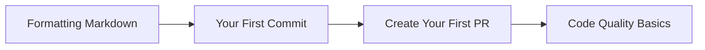

# Guides & Tutorials

Step-by-step guides to help you master common workflows with Talent Factory Claude Plugins.

---

## Getting Started Guides

-   :material-git:{ .lg .middle } **Your First Commit**

    ---

    Learn how to create professional git commits with `/commit`.

    **Duration**: 5 minutes  
    **Level**: Beginner

    [:octicons-arrow-right-24: Start Guide](first-commit.md)

-   :material-pull-request:{ .lg .middle } **Create Your First PR**

    ---

    Use `/create-pr` to create professional pull requests.

    **Duration**: 10 minutes
    **Level**: Beginner

    [:octicons-arrow-right-24: Start Guide](create-first-pr.md)

-   :material-language-markdown:{ .lg .middle } **Formatting Markdown**

    ---

    Produce clean, consistent Markdown with the `markdown-syntax-formatter` skill.

    **Level**: Beginner

    [:octicons-arrow-right-24: Start Guide](markdown-formatting.md)

---

## Workflow Guides

-   :material-clipboard-text:{ .lg .middle } **PRD-Based Workflow**

    ---

    Generate Product Requirements Documents and plan projects.

    **Duration**: 15 minutes  
    **Level**: Intermediate

    [:octicons-arrow-right-24: Start Guide](prd-workflow.md)

-   :material-link-variant:{ .lg .middle } **Linear Integration**

    ---

    Integrate with Linear for seamless project management.

    **Duration**: 20 minutes  
    **Level**: Intermediate

    [:octicons-arrow-right-24: Start Guide](linear-integration.md)

---

## All Guides

### Beginner Level

| Guide | Plugin | Topics |
|-------|--------|--------|
| [Your First Commit](first-commit.md) | git-workflow | Git, commits, pre-commit checks |
| [Create Your First PR](create-first-pr.md) | git-workflow | Pull requests, code review |
| [Formatting Markdown](markdown-formatting.md) | education | Markdown syntax, headings, lists, Swiss German |

### Intermediate Level

| Guide | Plugin | Duration | Topics |
|-------|--------|----------|--------|
| [PRD-Based Workflow](prd-workflow.md) | project-management | 15 min | Planning, documentation, PRDs |
| [Linear Integration](linear-integration.md) | project-management | 20 min | Linear, task management, sync |

### Advanced Level

Coming soon! We're working on advanced guides for:

- Custom plugin development
- CI/CD automation workflows
- Multi-plugin workflows
- Advanced git workflows with worktrees

---

## Learning Paths

### For Software Developers

**Recommended order**:

1. [Your First Commit](first-commit.md) - Learn git workflow basics
2. [Create Your First PR](create-first-pr.md) - Master pull requests
3. [PRD-Based Workflow](prd-workflow.md) - Plan projects professionally
4. [Linear Integration](linear-integration.md) - Integrate with Linear

---

### For Educators & Students

**Recommended order**:

1. [Formatting Markdown](markdown-formatting.md) - Write clean documentation
2. [Your First Commit](first-commit.md) - Learn professional git habits
3. [Create Your First PR](create-first-pr.md) - Submit work for review
4. Code Quality Basics (coming soon) - Use code review tools

---

### For Plugin Developers

**Recommended order**:

1. [Plugin Development](../development/plugin-development.md) - Learn plugin structure
2. Create Your First Plugin (coming soon) - Build a simple plugin
3. [Testing](../development/testing.md) - Test your plugin
4. [Contributing](../development/contributing.md) - Submit to marketplace

---

## Video Tutorials

Coming soon! We're planning video tutorials for:

- Quick start overview
- Common workflows
- Plugin development
- Advanced features

---

## Community Guides

Have you created a guide or tutorial? We'd love to feature it here!

**Submit your guide**:

1. Create a markdown file in `docs/guides/`
2. Follow the guide template
3. Submit a pull request
4. We'll review and publish

See [Contributing Guide](../development/contributing.md) for details.

---

## Need Help?

- **Questions**: Ask in [GitHub Discussions](https://github.com/talent-factory/claude-plugins/discussions)
- **Issues**: Report in [Issue Tracker](https://github.com/talent-factory/claude-plugins/issues)
- **Documentation**: Check [Reference](../reference/index.md)

---

## What's Next?

=== "I'm New"

    Start with beginner guides:
    
    1. [Your First Commit](first-commit.md)
    2. [Create Your First PR](create-first-pr.md)
    3. Explore [Plugin Catalog](../plugins/index.md)

=== "I'm Experienced"

    Try intermediate/advanced guides:
    
    1. [PRD-Based Workflow](prd-workflow.md)
    2. [Linear Integration](linear-integration.md)
    3. [Plugin Development](../development/index.md)

=== "I Want to Contribute"

    Help improve guides:
    
    1. Review [Contributing Guide](../development/contributing.md)
    2. Create your own guide
    3. Submit pull request

