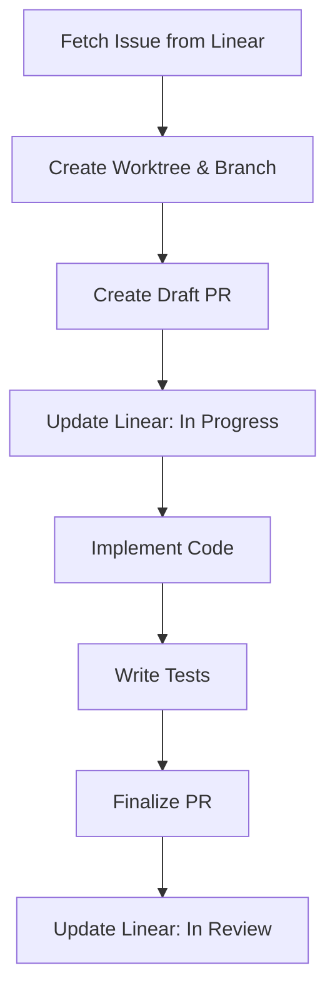

# Linear Integration

Learn how to connect Linear with Claude Code for seamless project management, task tracking, and automated workflows.

**Duration**: 20 minutes
**Level**: Intermediate
**Plugin**: project-management

---

## What You'll Learn

- How to set up the Linear MCP server
- Creating project plans directly in Linear
- Implementing Linear tasks with `/implement-task --linear`
- Synchronizing task status between code and Linear
- Best practices for Linear-based workflows

---

## Prerequisites

- project-management plugin installed
- A [Linear](https://linear.app) account with a workspace
- A Linear API key ([create one here](https://linear.app/settings/api))
- Familiarity with `/create-prd` and `/create-plan` (see [PRD-Based Workflow](prd-workflow.md))

---

## Step 1: Set Up the Linear MCP Server

The Linear integration uses the Model Context Protocol (MCP) to connect Claude Code with your Linear workspace.

### Generate an API Key

1. Go to [Linear Settings > API](https://linear.app/settings/api)
2. Click **Create Key**
3. Give it a descriptive name (e.g., "Claude Code")
4. Copy the generated key

!!! warning "Keep Your API Key Secret"
    Never commit your API key to version control. Store it securely using environment variables.

### Configure Claude Code

Add the Linear MCP server to your Claude Code settings. Create or edit `.mcp.json` in your project root:

```json
{
  "mcpServers": {
    "linear": {
      "command": "npx",
      "args": ["-y", "@modelcontextprotocol/server-linear"],
      "env": {
        "LINEAR_API_KEY": "<your-api-key>"
      }
    }
  }
}
```

!!! tip "Global Configuration"
    For access across all projects, add the configuration to `~/.claude/settings.json` instead.

### Verify the Connection

Restart Claude Code and check if Linear tools are available. You can test by asking:

```
What Linear teams do I have access to?
```

Claude should list your Linear teams and workspaces.

---

## Step 2: Create a Plan in Linear

Once the MCP server is configured, you can create project plans directly in Linear.

### Generate a PRD First

```bash
/create-prd "User Authentication mit OAuth2"
```

### Create the Plan with Linear

```bash
/create-plan --linear
```

Or with a specific PRD:

```bash
/create-plan --linear --prd docs/prds/auth-system.md
```

### What Gets Created in Linear

Claude creates a complete project structure in Linear:

```
✅ PRD read: PRD.md
✅ EPIC created: "User Authentication" (AUTH-100)
✅ 6 Issues generated:
   - AUTH-101: OAuth2 Provider Setup (3 SP)
   - AUTH-102: Login Flow Implementation (5 SP)
   - AUTH-103: Token Management (3 SP)
   - AUTH-104: Session Handling (3 SP)
   - AUTH-105: Unit Tests (2 SP)
   - AUTH-106: Documentation (1 SP)
✅ Dependencies linked
✅ Labels added: feature, authentication
✅ Total: 17 Story Points
```

### Linear Structure

| Claude Concept | Linear Entity | Description |
|---------------|---------------|-------------|
| Feature/EPIC | Project | Top-level container |
| Task | Issue | Individual work item |
| Dependency | Blocking Relation | Task ordering |
| Priority | Issue Priority | Urgent, High, Normal, Low |
| Story Points | Issue Estimate | Effort estimation |

---

## Step 3: Implement Linear Tasks

### Select a Task

```bash
# Interactive selection from Linear
/implement-task --linear

# Specific issue by ID
/implement-task --linear AUTH-101
```

### Implementation Workflow

When implementing a Linear task, Claude follows this workflow:



**Example output**:

```
✅ Linear Issue: AUTH-101 - OAuth2 Provider Setup
   Priority: High | Estimate: 3 SP | Status: Backlog

✅ Worktree: .worktrees/task-AUTH-101/
✅ Branch: feature/AUTH-101-oauth2-provider-setup
✅ Draft PR: #15
✅ Linear Status: Backlog → In Progress

🔨 Implementing...
   - Created: src/auth/oauth2-provider.ts
   - Created: src/auth/config.ts
   - Modified: src/app.ts
   - Created: tests/auth/oauth2-provider.test.ts

✅ All tests passing
✅ PR ready for review: https://github.com/your-org/your-repo/pull/15
✅ Linear Status: In Progress → In Review
```

### Branch Naming from Linear

Branch names are derived from the Linear issue:

| Issue Type/Label | Branch Name |
|-----------------|-------------|
| Feature | `feature/AUTH-101-oauth2-provider-setup` |
| Bug | `bugfix/AUTH-102-login-crash` |
| Documentation | `docs/AUTH-103-api-reference` |
| Refactoring | `refactor/AUTH-104-auth-module` |

### Status Synchronization

Claude automatically updates Linear issue status:

| Stage | Linear Status |
|-------|--------------|
| Task selected | `Backlog` → `In Progress` |
| PR created | Stays `In Progress` |
| PR ready for review | `In Progress` → `In Review` |
| PR merged | `In Review` → `Done` |

---

## Step 4: Track Progress

### In Linear

Use Linear's built-in features to track progress:

- **Board View** - See all tasks across columns (Backlog, In Progress, In Review, Done)
- **Cycle View** - Track sprint progress
- **Project View** - Overview of your EPIC with progress percentage

### In Claude Code

Ask Claude about your project status:

```
What's the status of my Linear project "User Authentication"?
```

Claude will query Linear and provide a summary:

```
📊 Project: User Authentication
   Total Issues: 6
   ✅ Done: 2 (AUTH-101, AUTH-105)
   🔄 In Progress: 1 (AUTH-102)
   📋 Backlog: 3 (AUTH-103, AUTH-104, AUTH-106)

   Progress: 33% (7/17 SP completed)
```

---

## Complete Workflow Example

Here's the full Linear-integrated workflow from idea to implementation:

```bash
# 1. Define requirements
/create-prd "User Authentication mit OAuth2"

# 2. Review and refine PRD.md
# ... edit PRD.md as needed ...

# 3. Create plan in Linear
/create-plan --linear

# 4. Check your Linear board
# → All issues visible with priorities and estimates

# 5. Implement tasks one by one
/implement-task --linear AUTH-101
# → Claude creates worktree, branch, draft PR
# → Implements code, writes tests
# → Creates PR, updates Linear status

/implement-task --linear AUTH-102
# → Next task...

# 6. Track progress in Linear
# → Board shows real-time status
# → Cycle metrics update automatically
```

---

## Advanced Features

### Filtering Tasks

When using interactive selection, Claude shows available tasks:

```bash
/implement-task --linear
```

```
Available tasks for "User Authentication":

  1. AUTH-103: Token Management (3 SP) - High Priority
  2. AUTH-104: Session Handling (3 SP) - Normal Priority
  3. AUTH-106: Documentation (1 SP) - Low Priority

  ℹ️ AUTH-101, AUTH-102 are in progress
  ℹ️ AUTH-105 is completed

Select a task (1-3):
```

### Labels and Categories

Claude adds appropriate labels to Linear issues based on task content:

- `feature` - New functionality
- `bug` - Bug fixes
- `documentation` - Docs changes
- `testing` - Test-related tasks
- `infrastructure` - DevOps/CI/CD tasks

### Linking PRs to Issues

When Claude creates a PR for a Linear task, it includes the issue reference in the PR description. Linear automatically links the PR to the issue.

---

## Best Practices

### ✅ Do

- **Keep Linear as source of truth** - All task management happens in Linear
- **Use consistent naming** - Let Claude generate branch names from issue IDs
- **Update status promptly** - Claude does this automatically, but verify after merges
- **Review before planning** - Refine your PRD before running `/create-plan --linear`
- **Use cycles/sprints** - Organize tasks into manageable iterations
- **Add context to issues** - Include technical notes and acceptance criteria

### ❌ Don't

- **Create duplicate issues** - Claude checks for duplicates, but verify manually
- **Skip the PRD** - Always start with requirements before creating Linear issues
- **Ignore dependencies** - Respect task ordering to avoid blocked work
- **Bypass the workflow** - Use `/implement-task --linear` instead of manual branch creation
- **Forget cleanup** - Remove worktrees after PRs are merged

---

## Troubleshooting

### Linear MCP Server Not Found

**Problem**: Claude doesn't recognize Linear tools.

**Solution**:

1. Check `.mcp.json` configuration is correct
2. Verify the API key is valid
3. Restart Claude Code after configuration changes
4. Test with: `npx -y @modelcontextprotocol/server-linear` (should start without errors)

### API Key Invalid

**Problem**: Authentication errors when accessing Linear.

**Solution**:

1. Generate a new API key at [Linear Settings > API](https://linear.app/settings/api)
2. Update `.mcp.json` with the new key
3. Ensure the key has the required permissions (read + write)
4. Restart Claude Code

### Issues Not Created

**Problem**: `/create-plan --linear` fails to create issues.

**Solution**:

1. Verify you have write access to the Linear team
2. Check that the team name/ID is correct
3. Ensure your PRD is well-structured (goals, requirements, metrics)
4. Try with `--interactive` flag for guided creation

### Status Not Updating

**Problem**: Linear issue status doesn't change after implementation.

**Solution**:

1. Verify MCP server is still connected
2. Check Linear permissions (need write access)
3. Manually update status in Linear if automation fails
4. Review the Linear workflow states match expected values

---

## What's Next?

Now that you have Linear integrated, explore:

1. **[Plugin Catalog](../plugins/index.md)** - Discover all available plugins
2. **[Plugin Development](../development/plugin-development.md)** - Build your own plugins
3. **[Architecture](../development/architecture.md)** - Understand the system design

---

## Related Resources

- **[Project Management Plugin](../plugins/project-management.md)** - Full plugin documentation
- **[PRD-Based Workflow](prd-workflow.md)** - Requirements-driven development
- **[Your First Commit](first-commit.md)** - Git commit workflow
- **[Create Your First PR](create-first-pr.md)** - Pull request workflow
