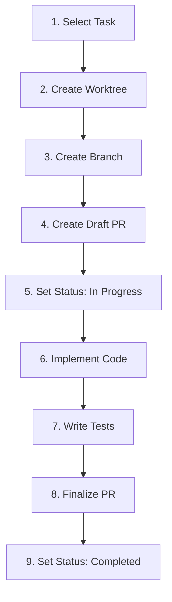

# PRD-Based Workflow

Learn how to plan features professionally using Product Requirements Documents (PRDs) and structured project plans with the project-management plugin.

**Duration**: 15 minutes
**Level**: Intermediate
**Plugin**: project-management

---

## What You'll Learn

- How to generate PRDs with `/create-prd`
- How to create project plans with `/create-plan`
- How to implement tasks with `/implement-task`
- The full planning-to-implementation workflow
- Best practices for requirements-driven development

---

## Prerequisites

- project-management plugin installed
- A feature idea or requirement to plan
- Familiarity with `/commit` and `/create-pr` (see [beginner guides](index.md))

---

## Recommended Project Structure

Before starting, understand where your planning artifacts will be stored:

```
your-project/
├── PRDs/                              # Product Requirements Documents
│   ├── 01-feature-name.md             # Your first PRD
│   ├── 02-another-feature.md          # Additional PRDs
│   └── ...
│
├── .plans/                            # Project Plans (generated by /create-plan)
│   └── [feature-name]/                # One folder per feature (kebab-case)
│       ├── EPIC.md                    # Feature overview & business value
│       ├── STATUS.md                  # Progress tracking & dependencies
│       └── tasks/
│           ├── task-001-[slug].md     # Individual tasks
│           ├── task-002-[slug].md
│           └── ...
│
├── .worktrees/                        # Git Worktrees (created by /implement-task)
│   ├── task-001/                      # Isolated workspace for task 001
│   └── task-002/                      # Isolated workspace for task 002
│
└── src/                               # Your main codebase
```

!!! tip "PRD Organization"
    For larger projects with multiple features, prefix your PRDs with numbers (`01-`, `02-`) to maintain a clear order. Store them in a dedicated `PRDs/` or `docs/prds/` folder.

---

## Overview: The Full Workflow

The PRD-based workflow consists of three stages:


| Stage | Command | Output |
|-------|---------|--------|
| 1. Requirements | `/create-prd` | `PRD.md` document |
| 2. Planning | `/create-plan` | EPICs + Tasks in `.plans/` or Linear |
| 3. Implementation | `/implement-task` | Code + Pull Request |

---

## Stage 1: Create a PRD

### Run the Command

Describe your feature in natural language:

```bash
/create-prd "Dark Mode Toggle für die Einstellungsseite"
```

With a custom output path:

```bash
/create-prd "KI-gestützte Budgetierung" docs/prds/budget-ai.md
```

### What Claude Generates

Claude creates a structured PRD with these sections:

1. **Executive Summary** - Problem, solution, and impact in 3-5 sentences
2. **Problem Statement** - Current state, pain points, and evidence
3. **Goals & Success Metrics** - SMART objectives with measurable targets
4. **User Stories & Personas** - Who benefits and how
5. **Functional Requirements** - Prioritized with MoSCoW method
6. **Non-Functional Requirements** - Performance, security, accessibility
7. **Out of Scope** - What will NOT be built (and why)
8. **Risk Assessment** - Risk matrix with mitigation strategies
9. **Timeline & Milestones** - Phased delivery plan

### Example Output

```
✅ PRD created: PRD.md

📋 Executive Summary:
   Dark Mode Toggle für die Einstellungsseite ermöglicht
   Nutzern das Umschalten zwischen hellem und dunklem Theme...

📊 Requirements:
   Must-Have: 4 | Should-Have: 3 | Could-Have: 2

📏 Metrics:
   - 80% user adoption within 30 days
   - < 100ms theme switch latency
```

### PRD Quality Checklist

A good PRD should answer these questions:

- [x] **What** are we building?
- [x] **Who** is it for?
- [x] **Why** are we building it?
- [x] **How** will we measure success?
- [x] **What** is out of scope?
- [x] **What** are the risks?

!!! tip "User-Centric, Not Solution-Centric"
    Focus your PRD on the **problem** and **user needs**, not on technical implementation details. Leave the "how" for the planning stage.

---

## Stage 2: Create a Project Plan

### Run the Command

Generate a plan from your PRD:

=== "Filesystem (Default)"

    ```bash
    /create-plan
    ```

    This reads `PRD.md` from the current directory and creates:

    ```
    .plans/dark-mode-toggle/
    ├── EPIC.md          # Feature overview
    ├── STATUS.md        # Progress tracking
    └── tasks/
        ├── task-001-ui-toggle-component.md
        ├── task-002-theme-state-management.md
        ├── task-003-css-variables-setup.md
        ├── task-004-persistence-layer.md
        ├── task-005-accessibility-support.md
        ├── task-006-unit-tests.md
        ├── task-007-integration-tests.md
        └── task-008-documentation.md
    ```

=== "Linear"

    ```bash
    /create-plan --linear
    ```

    This creates issues directly in Linear:

    ```
    ✅ EPIC created: "Dark Mode Toggle" (LIN-123)
    ✅ 8 Issues generated:
       - LIN-124: UI Toggle Component (3 SP)
       - LIN-125: Theme State Management (5 SP)
       - LIN-126: CSS Variables Setup (2 SP)
       - ...
    ✅ Dependencies linked
    ✅ Labels added
    ```

    !!! note "Linear Setup Required"
        For Linear integration, see [Linear Integration Guide](linear-integration.md).

### Custom PRD Path

Point to a specific PRD file:

```bash
/create-plan --prd docs/prds/budget-ai.md
```

### Understanding Task Breakdown

Claude breaks the PRD into **ATOMIC tasks**:

| Criterion | Description |
|-----------|-------------|
| **A**ctionable | Can be started immediately |
| **T**estable | Has clear acceptance criteria |
| **O**wnable | Assignable to one developer |
| **M**easurable | Story Points (1, 2, 3, 5, 8) |
| **I**ndependent | Minimal dependencies on other tasks |
| **C**omplete | Self-contained unit of work |

### Example Task File

Each task in `.plans/*/tasks/` contains:

```markdown
# Task 001: UI Toggle Component

**Priority**: Must-Have
**Story Points**: 3
**Dependencies**: None
**Recommended Agent**: frontend-developer

## Description

Create a toggle switch component for the settings page
that allows users to switch between light and dark mode.

## Acceptance Criteria

- [ ] Toggle component renders in settings page
- [ ] Toggle reflects current theme state
- [ ] Clicking toggle switches the theme
- [ ] Smooth transition animation (< 300ms)
- [ ] Accessible via keyboard (Tab + Enter/Space)

## Technical Notes

- Use existing design system components
- Store preference in localStorage
```

### Agent Recommendations

Claude suggests the best AI agent for each task type:

| Task Type | Recommended Agent | Use Case |
|-----------|-------------------|----------|
| Frontend | `frontend-developer` | UI components, styling |
| Java | `java-developer` | Spring Boot, enterprise |
| Python | `python-expert` | Django, FastAPI |
| Code Review | `code-reviewer` | Quality assurance |
| Documentation | `markdown-syntax-formatter` | Docs, READMEs |

---

## Stage 3: Implement Tasks

### Run the Command

=== "Filesystem"

    ```bash
    # Interactive task selection
    /implement-task

    # Specific task
    /implement-task task-001

    # With plan context
    /implement-task --plan dark-mode-toggle task-003
    ```

=== "Linear"

    ```bash
    # Interactive selection
    /implement-task --linear

    # Specific issue
    /implement-task --linear LIN-124
    ```

### What Happens

Claude orchestrates the full implementation workflow:



**Step-by-step output**:

```
✅ Task selected: task-001-ui-toggle-component
✅ Worktree created: .worktrees/task-001/
✅ Branch: feature/task-001-ui-toggle-component
✅ Draft PR created: #42
✅ Status: In Progress

🔨 Implementing...
   - Created: src/components/ThemeToggle.tsx
   - Modified: src/pages/Settings.tsx
   - Created: tests/ThemeToggle.test.tsx

✅ Tests passing: 5/5
✅ PR finalized: https://github.com/your-org/your-repo/pull/42
✅ Status: Completed
```

### Git Worktrees

Each task gets its own worktree for parallel development:

```
project-root/
├── .worktrees/
│   ├── task-001/    # Working on UI toggle
│   ├── task-002/    # Working on state management
│   └── task-003/    # Working on CSS variables
├── src/             # Main working directory
└── .plans/          # Project plans
```

!!! tip "Parallel Work"
    Worktrees allow you to work on multiple tasks simultaneously without switching branches in your main directory.

---

## Complete Workflow Example

Here's the full end-to-end workflow:

```bash
# 1. Define requirements
/create-prd "Dark Mode Toggle für die Einstellungsseite"

# 2. Review the generated PRD
# ... read and refine PRD.md ...

# 3. Create project plan
/create-plan

# 4. Review generated tasks
# ... check .plans/dark-mode-toggle/tasks/ ...

# 5. Start implementing (task by task)
/implement-task task-001
# ... Claude implements, tests, and creates PR ...

/implement-task task-002
# ... next task ...

# 6. Continue until all tasks are done
```

---

## Best Practices

### Writing Good Feature Descriptions

The quality of your `/create-prd` input determines the quality of the output:

=== "✅ Good"

    ```bash
    /create-prd "Dark Mode Toggle: Nutzer sollen in den Einstellungen
    zwischen hellem und dunklem Theme wechseln können. Das Theme soll
    persistent gespeichert werden und System-Präferenzen respektieren."
    ```

=== "❌ Too Vague"

    ```bash
    /create-prd "Dark Mode hinzufügen"
    ```

### PRD Review Checklist

Before moving to planning, verify your PRD:

- [ ] Problem is clearly defined with evidence
- [ ] Goals are SMART (Specific, Measurable, Achievable, Relevant, Time-bound)
- [ ] User stories have acceptance criteria
- [ ] Requirements are prioritized (Must/Should/Could/Won't)
- [ ] Out of scope is explicitly defined
- [ ] Risks are identified with mitigation strategies

### Planning Tips

- **Start small** - Begin with Must-Have requirements only
- **Keep tasks atomic** - Each task should be completable in 1-2 days
- **Define dependencies** - Know which tasks block others
- **Review before implementing** - Refine the plan with your team

### Implementation Tips

- **One task at a time** - Focus on completing one task before starting the next
- **Follow acceptance criteria** - They define "done"
- **Write tests** - Each task should include relevant tests
- **Create small PRs** - One task = one PR for easier review

---

## Troubleshooting

### PRD Too Generic

**Problem**: Generated PRD lacks specific requirements.

**Solution**:

1. Provide more context in your feature description
2. Include specific user scenarios
3. Mention technical constraints upfront
4. Refine the generated PRD manually before planning

### Plan Has Too Many Tasks

**Problem**: Task breakdown creates 20+ tasks for a small feature.

**Solution**:

1. Review your PRD scope - it might be too broad
2. Merge related tasks that are too granular
3. Use the `--interactive` flag: `/create-plan --interactive`
4. Focus on Must-Have requirements first

### Task Implementation Fails

**Problem**: `/implement-task` can't complete a task.

**Solution**:

1. Check that all dependencies are completed first
2. Verify the task description is clear and actionable
3. Break the task into smaller sub-tasks if too complex
4. Check the worktree status: `git worktree list`

---

## What's Next?

Now that you know the PRD workflow, explore:

1. **[Linear Integration](linear-integration.md)** - Manage tasks in Linear
2. **[Plugin Catalog](../plugins/index.md)** - Discover more plugins
3. **[Plugin Development](../development/plugin-development.md)** - Build your own plugins

---

## Related Resources

- **[Project Management Plugin](../plugins/project-management.md)** - Full plugin documentation
- **[Your First Commit](first-commit.md)** - Git commit workflow
- **[Create Your First PR](create-first-pr.md)** - Pull request workflow
- **[Linear Integration](linear-integration.md)** - Linear project management
