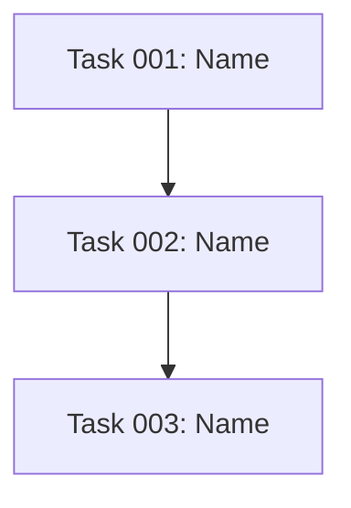

# Filesystem-basierte Projektplanung

Detaillierte Anleitung zur Filesystem-basierten Projektplanung mit `.plans/`-Struktur.

## Verzeichnisstruktur

```
.plans/
├── [feature-name]/
│   ├── EPIC.md          # Feature-Übersicht
│   ├── STATUS.md        # Progress-Tracking
│   └── tasks/
│       ├── task-001-[slug].md
│       ├── task-002-[slug].md
│       └── ...
```

**Feature-Name in kebab-case**:
- "Dark Mode Toggle" → `dark-mode-toggle`
- "RAG-basiertes System" → `rag-basiertes-system`
- "User Authentication" → `user-authentication`

## EPIC.md Template

```markdown
# [Feature-Name]

## Status
- **Created**: [Datum]
- **Status**: planned | in_progress | completed
- **Priority**: high | medium | low

## Executive Summary

[3-5 Sätze aus PRD Executive Summary]

## Business Value

**Problem**: [Kern-Problem]

**Lösung**: [Lösungsansatz]

**Impact**:
- **Zeit**: [Zeit-Einsparung]
- **Kosten**: [Kosten-Einsparung]
- **Qualität**: [Qualitätsverbesserung]

## Success Metrics

| Metric | Baseline | Target | Timeline |
|--------|----------|--------|----------|
| [Metrik 1] | [Baseline] | [Target] | [Timeline] |

## Timeline & Milestones

| Milestone | Target Date | Description |
|-----------|-------------|-------------|
| [Phase 1] | [Date] | [Description] |

## Dependencies

### External Dependencies
- [Dependency 1]

### Internal Dependencies
- [Dependency 1]

## Key Risks

| Risiko | Impact | Mitigation |
|--------|--------|------------|
| [Risk 1] | [Impact] | [Mitigation] |

## MVP Scope

### MUST-HAVE Features
1. [Feature 1]

### SHOULD-HAVE (Post-MVP)
- [Feature 1]

### WON'T-HAVE (Out of Scope)
- [Feature 1]

## Link to PRD

[Full PRD Document](../../[prd-file].md)
```

## STATUS.md Template

```markdown
# Project Status: [Feature-Name]

**Last Updated**: [Datum]

## Progress Overview

- **Total Tasks**: [N]
- **Completed**: [N] ([%]%)
- **In Progress**: [N] ([%]%)
- **Pending**: [N] ([%]%)
- **Blocked**: [N] ([%]%)

## Tasks by Priority

### Must-Have (MVP)
- [ ] **task-NNN**: [Task-Name] ([SP] SP) - [status]

### Should-Have (Post-MVP)
- [ ] **task-NNN**: [Task-Name] ([SP] SP) - [status]

## Tasks by Status

### Completed ✅
[None yet oder Liste]

### In Progress 🚧
[None yet oder Liste]

### Pending 📋
- **task-NNN-[slug].md** ([SP] SP) [[agent]]

### Blocked 🚫
[None oder Liste mit Blocker-Grund]

## Story Points Summary

- **Total SP**: [N]
- **Must-Have SP**: [N] ([%]%)
- **Should-Have SP**: [N] ([%]%)

## Dependencies Graph



## Critical Path

```
[Task 1] → [Task 2] → [Task 3] → Launch
```

## Next Steps

### Immediate (Woche 0-1)
1. [Step 1]

### Short-Term (Woche 2-4)
1. [Step 1]

## Team-Assignments

| Agent/Role | Primary Tasks | Workload |
|------------|---------------|----------|
| **[agent]** | task-NNN, task-NNN | ~[N] SP |
```

## Task-Datei Template

**Dateiname**: `task-NNN-[slug].md`

```markdown
# Task-NNN: [Task-Titel]

## Metadata
- **ID**: task-NNN
- **Status**: pending | in_progress | completed | blocked
- **Priority**: must | should | could | wont
- **Estimate**: [N] Story Points
- **Labels**: [label1, label2, ...]
- **Assignee**: [agent-name]
- **Created**: [Datum]
- **Updated**: [Datum]

## Description

[Detaillierte Beschreibung der Aufgabe]

**User Story**: Als [Persona] möchte ich [Aktion] damit [Nutzen].

## Acceptance Criteria

- [ ] Kriterium 1
- [ ] Kriterium 2

## Dependencies

- **Requires**: [task-XXX oder None]
- **Blocks**: [task-YYY oder None]

## Agent Recommendation

**Recommended Agent**: `[agent-name]`

**Rationale**: [Warum dieser Agent empfohlen wird]
```

