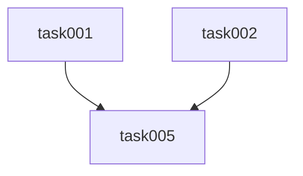

# Filesystem Task Management

Comprehensive guide to managing filesystem-based tasks.

## Directory Structure

```
.plans/
├── <feature-name>/
│   ├── PRD.md              # Product Requirements Document
│   ├── STATUS.md           # Automatically generated
│   └── tasks/
│       ├── task-001-<name>.md
│       ├── task-002-<name>.md
│       └── ...
```

## Task File Format

```markdown
# Task-NNN: <Title>

## Metadata

- **ID**: task-NNN
- **Status**: pending | in_progress | completed | blocked
- **Priority**: must | should | could | wont
- **Estimate**: <N> Story Points
- **Labels**: [<label1>, <label2>, ...]
- **Assignee**: <name>
- **Created**: YYYY-MM-DD
- **Updated**: YYYY-MM-DD

## Description

<Task description>

## Acceptance Criteria

- [ ] Criterion 1
- [ ] Criterion 2
- [ ] Criterion 3

## Dependencies

- **Requires**: task-001, task-002
- **Blocks**: task-005
```

## Task Status Lifecycle

```
pending
  ↓
in_progress
  ↓          ↓
completed  blocked
             ↓
          pending (after blocker resolution)
```

### Status Definitions

| Status        | Definition                  | Next Action         |
| ------------- | --------------------------- | ------------------- |
| `pending`     | Ready for implementation    | May be started      |
| `in_progress` | Currently being implemented | Complete the code   |
| `completed`   | Finished and merged         | No action required  |
| `blocked`     | Cannot proceed              | Resolve the blocker |

## Status Update (CRITICAL for Parallel Work)

> **IMPORTANT**: Status updates MUST be performed in the **main branch** (main/develop) and pushed immediately. This ensures other developers can see that a task is already in progress, preventing overlap during parallel work.

### Workflow for Status Update

1. **Remain in the main branch** (do not switch to worktree)
2. **Update the task file**
3. **Update STATUS.md**
4. **Commit and push**
5. **Only then switch to the worktree**

### Using the Edit Tool

```python
# pending → in_progress
old_string = "- **Status**: pending"
new_string = "- **Status**: in_progress"
edit_file(task_file, old_string, new_string)

# Update the Updated date
from datetime import date
today = date.today().isoformat()
edit_file(task_file, old_date_line, f"- **Updated**: {today}")
```

### Git Commit for Status Update

> **MANDATORY**: Push is required after the commit.

```bash
# Start - IN THE MAIN BRANCH, not in the worktree
git add .plans/<feature>/tasks/task-001-*.md
git add .plans/<feature>/STATUS.md
git commit -m "🔄 chore: Start task-001 implementation"
git push origin main  # IMPORTANT: Push so others can see it

# Complete (after PR merge, back in main branch)
git commit -m "✅ chore: Mark task-001 as completed"
git push origin main

# Block
git commit -m "🚫 chore: Block task-001 (awaiting API spec)"
git push origin main
```

## STATUS.md Regeneration

### When to Regenerate

- Task status changes
- New tasks added
- Tasks deleted or merged
- Dependencies modified

### STATUS.md Structure

````markdown
# Project Status: <Feature-Name>

**Last Updated**: YYYY-MM-DD HH:MM

## Progress Overview

- **Total Tasks**: N
- **Completed**: N (X%)
- **In Progress**: N (X%)
- **Pending**: N (X%)
- **Blocked**: N (X%)

## Tasks by Priority

### Must-Have (MVP)

- [x] task-001: UI Toggle (3 SP) - completed
- [ ] task-002: State Management (5 SP) - in_progress

### Should-Have

- [ ] task-005: Integration Tests (3 SP) - blocked

## Tasks by Status

### Completed

- task-001: UI Toggle (3 SP)

### In Progress

- task-002: State Management (5 SP)

### Blocked

- task-005: Integration Tests (3 SP)
  - **Reason**: Waiting for task-002

## Dependencies Graph


````

````

## Dependencies

### Format in Task File

```markdown
## Dependencies
- **Requires**: task-001, task-003  ← Must be completed first
- **Blocks**: task-005
````

### Dependency Check Before Task Start

```bash
# Check dependencies
grep "**Requires**:" .plans/*/tasks/task-005-*.md
# → task-001, task-003

# Verify status of required tasks
grep "**Status**:" .plans/*/tasks/task-001-*.md
# → - **Status**: completed ✅

grep "**Status**:" .plans/*/tasks/task-003-*.md
# → - **Status**: pending ❌
```

## Best Practices

### Recommended

1. **Commit status updates immediately**
2. **Keep STATUS.md current**
3. **Document dependencies**
4. **Use clear commit messages**

### Avoid

1. **Manual STATUS.md edits** - Always regenerate
2. **Batching multiple status updates**
3. **Outdated status files**

## See Also

- [workflow.md](./workflow.md) - Complete workflow documentation
- [best-practices.md](./best-practices.md) - Best practices
- [troubleshooting.md](./troubleshooting.md) - Problem resolution
