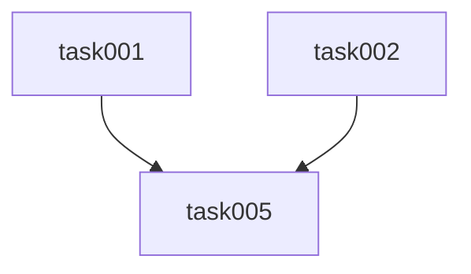

# Filesystem Task Management

Detaillierte Anleitung zum Management von Filesystem-basierten Tasks.

## Verzeichnisstruktur

```
.plans/
├── <feature-name>/
│   ├── PRD.md              # Product Requirements Document
│   ├── STATUS.md           # Automatisch generiert
│   └── tasks/
│       ├── task-001-<name>.md
│       ├── task-002-<name>.md
│       └── ...
```

## Task-Datei Format

```markdown
# Task-NNN: <Titel>

## Metadata
- **ID**: task-NNN
- **Status**: pending | in_progress | completed | blocked
- **Priority**: must | should | could | wont
- **Estimate**: <N> Story Points
- **Labels**: [<label1>, <label2>, ...]
- **Assignee**: <name>
- **Created**: YYYY-MM-DD
- **Updated**: YYYY-MM-DD

## Description
<Beschreibung der Aufgabe>

## Acceptance Criteria
- [ ] Kriterium 1
- [ ] Kriterium 2
- [ ] Kriterium 3

## Dependencies
- **Requires**: task-001, task-002
- **Blocks**: task-005
```

## Task-Status-Lifecycle

```
pending
  ↓
in_progress
  ↓          ↓
completed  blocked
             ↓
          pending (nach Blocker-Auflösung)
```

### Status-Definitionen

| Status | Bedeutung | Nächster Schritt |
|--------|-----------|------------------|
| `pending` | Bereit zur Bearbeitung | Kann gestartet werden |
| `in_progress` | Wird aktiv bearbeitet | Code fertigstellen |
| `completed` | Fertig und merged | Keine Aktion nötig |
| `blocked` | Kann nicht fortgesetzt werden | Blocker auflösen |

## Status-Update (KRITISCH für paralleles Arbeiten)

> ⚠️ **WICHTIG**: Status-Updates MÜSSEN im **Hauptbranch** (main/develop) erfolgen und sofort gepusht werden! Nur so können andere Entwickler sehen, dass ein Task bereits in Bearbeitung ist. Dies verhindert Überschneidungen bei paralleler Arbeit.

### Workflow für Status-Update

1. **Im Hauptbranch bleiben** (nicht in Worktree wechseln!)
2. **Task-Datei aktualisieren**
3. **STATUS.md aktualisieren**
4. **Committen und pushen**
5. **Dann erst in Worktree wechseln**

### Mit Edit-Tool

```python
# pending → in_progress
old_string = "- **Status**: pending"
new_string = "- **Status**: in_progress"
edit_file(task_file, old_string, new_string)

# Updated-Datum aktualisieren
from datetime import date
today = date.today().isoformat()
edit_file(task_file, old_date_line, f"- **Updated**: {today}")
```

### Git-Commit für Status-Update

> 🔴 **OBLIGATORISCH**: Nach dem Commit MUSS gepusht werden!

```bash
# Start - IM HAUPTBRANCH, nicht im Worktree!
git add .plans/<feature>/tasks/task-001-*.md
git add .plans/<feature>/STATUS.md
git commit -m "🔄 chore: Starte task-001 Implementierung"
git push origin main  # WICHTIG: Pushen damit andere es sehen!

# Complete (nach PR-Merge, wieder im Hauptbranch)
git commit -m "✅ chore: Markiere task-001 als abgeschlossen"
git push origin main

# Block
git commit -m "🚫 chore: Blockiere task-001 (warte auf API-Spec)"
git push origin main
```

## STATUS.md Regenerierung

### Wann regenerieren?

- Task-Status ändert sich
- Neue Tasks hinzugefügt
- Tasks gelöscht oder zusammengeführt
- Dependencies geändert

### STATUS.md Struktur

```markdown
# Project Status: <Feature-Name>

**Last Updated**: YYYY-MM-DD HH:MM

## Progress Overview
- **Total Tasks**: N
- **Completed**: N (X%)
- **In Progress**: N (X%)
- **Pending**: N (X%)
- **Blocked**: N (X%)

## Tasks by Priority

### Must-Have (MVP)
- [x] task-001: UI Toggle (3 SP) - completed
- [ ] task-002: State Management (5 SP) - in_progress

### Should-Have
- [ ] task-005: Integration Tests (3 SP) - blocked

## Tasks by Status

### Completed ✅
- task-001: UI Toggle (3 SP)

### In Progress 🚧
- task-002: State Management (5 SP)

### Blocked 🚫
- task-005: Integration Tests (3 SP)
  - **Reason**: Waiting for task-002

## Dependencies Graph

```

## Dependencies

### Format in Task-Datei

```markdown
## Dependencies
- **Requires**: task-001, task-003  ← Müssen completed sein!
- **Blocks**: task-005
```

### Dependency-Check vor Task-Start

```bash
# Dependencies prüfen
grep "**Requires**:" .plans/*/tasks/task-005-*.md
# → task-001, task-003

# Status der Required-Tasks prüfen
grep "**Status**:" .plans/*/tasks/task-001-*.md
# → - **Status**: completed ✅

grep "**Status**:" .plans/*/tasks/task-003-*.md
# → - **Status**: pending ❌
```

## Best Practices

### DO ✅

1. **Status-Update sofort committen**
2. **STATUS.md immer aktuell halten**
3. **Dependencies dokumentieren**
4. **Klare Commit-Messages**

### DON'T ❌

1. **Keine manuellen STATUS.md-Edits** - Immer regenerieren
2. **Nicht mehrere Status-Updates batchen**
3. **Keine veralteten Status-Dateien**

## Siehe auch

- [workflow.md](./workflow.md) - Vollständiger Workflow
- [best-practices.md](./best-practices.md) - Best Practices
- [troubleshooting.md](./troubleshooting.md) - Problemlösungen

