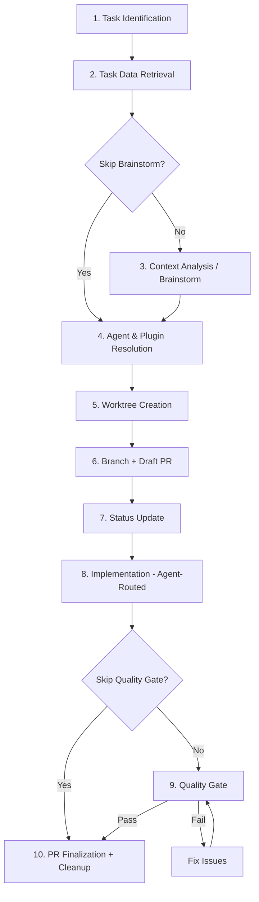

# Workflow: Task Implementation

Detailed workflow for implementing tasks (Filesystem or Linear) with intelligent plugin orchestration.

## Overview

The workflow comprises 10 phases:

```
 1. Task Identification
    ↓
 2. Task Data Retrieval
    ↓
 3. Context Analysis (Brainstorm)          ★ NEW
    ↓
 4. Agent & Plugin Resolution              ★ NEW
    ↓
 5. Worktree Creation
    ↓
 6. Branch Creation (including Submodules)
    ↓
 7. Task Status Update
    ↓
 8. Implementation (Agent-Routed)
    ↓
 9. Quality Gate                           ★ NEW
    ↓
10. Finalization and Cleanup
```

## Phase 1: Task Identification

### With Task ID Argument

**Filesystem**: `/implement-task task-001`
**Linear**: `/implement-task --linear PROJ-123`

**Workflow**:

1. Parse and validate task ID
2. Retrieve task (Filesystem: `.plans/*/tasks/`, Linear: MCP)
3. If multiple matches: Interactive selection

### Without Argument (Interactive)

**Filesystem**: `/implement-task`
**Linear**: `/implement-task --linear`

**Workflow**:

1. List available tasks
2. User selects task
3. Load task data

### Validation Checks

- Task exists
- Task is not already completed
- Task has valid status (pending/Backlog)
- Dependencies satisfied (Filesystem only)

## Phase 2: Task Data Retrieval

### Common Data Fields

| Field               | Filesystem               | Linear                  |
| ------------------- | ------------------------ | ----------------------- |
| Title               | From Markdown            | `issue.title`           |
| Description         | `## Description`         | `issue.description`     |
| Labels              | `**Labels**:`            | `issue.labels.nodes`    |
| Status              | `**Status**:`            | `issue.state.name`      |
| Acceptance Criteria | `## Acceptance Criteria` | Parsed from description |
| Agent Recommendation | `## Agent Recommendation` | Parsed from description |

### Data Structure

```python
task = {
    "id": "task-001" | "PROJ-123",
    "title": "UI Toggle Component",
    "description": "...",
    "status": "pending" | "Backlog",
    "labels": ["feature", "ui"],
    "acceptance_criteria": [
        "Toggle button renders correctly",
        "State persists in localStorage"
    ],
    "agent_recommendation": "frontend-developer",  # May be None
    "provider": "filesystem" | "linear"
}
```

## Phase 3: Context Analysis (Brainstorm)

> **NEW**: Systematic analysis before implementation. Skippable with `--skip-brainstorm`.

### Purpose

Understand the codebase deeply before writing any code. This replaces ad-hoc exploration with structured analysis.

### Superpowers Integration (Preferred)

If the Superpowers plugin (`obra/superpowers`) is available:

```bash
/superpowers:brainstorm
```

This initiates an interactive Socratic design session that refines requirements, explores edge cases, and captures constraints.

### Built-in Analysis (Fallback)

If Superpowers is not available, perform 5-step analysis:

1. **Technology Stack Detection**: Scan for package.json, pom.xml, build.gradle.kts, etc.
2. **Affected Code Analysis**: Derive affected files from task description using Grep/Glob
3. **Architecture Pattern Recognition**: Analyze project structure for conventions
4. **Dependency Impact Assessment**: Check internal, task, and external dependencies
5. **Implementation Strategy**: Create structured plan as TodoWrite checklist

### Output

A concrete implementation strategy captured in TodoWrite, informing all subsequent phases.

**Details**: [context-analysis.md](./context-analysis.md)

## Phase 4: Agent & Plugin Resolution

> **NEW**: Automatically select optimal agents and plugins based on context analysis.

### Resolution Priority

1. **Explicit Agent Recommendation** from task file (highest priority)
2. **Technology Stack Match** from context analysis
3. **Label-Based Match** from task labels
4. **Default**: No specific agent (generalist implementation)

### Agent Mapping

| Detected Context | Resolved Agent | Plugin |
| --- | --- | --- |
| Java / Spring Boot | `@java-developer` | `development` |
| Python / Django / FastAPI | `@python-expert` | `code-quality` |
| React / TypeScript | `@frontend-developer` | `code-quality` |
| Documentation / Markdown | `@markdown-syntax-formatter` | `education` |
| Security-Critical | `@code-reviewer` (proactive) | `code-quality` |

### Plugin Dependencies

Prepare integrations based on resolved context:

| Plugin | When Used | Required |
| --- | --- | --- |
| `git-workflow` | Commits, PR creation | Always |
| `superpowers` | Brainstorm phase | Optional |
| `code-quality` | Review, linting, agents | Optional |
| `development` | Java agent | Optional |
| `education` | Markdown formatter | Optional |

**Details**: [agent-routing.md](./agent-routing.md)

## Phase 5: Worktree Creation

> **IMPORTANT**: Git worktrees are used for parallel work on multiple tasks.

### Worktree Concept

Each task is processed in its own worktree:

- **Directory**: `.worktrees/task-<task-id>/`
- **Enables**: Parallel work on multiple tasks without branch switching
- **Isolation**: Each task has its own working copy

### Pre-Worktree Checks

```bash
# 1. Working directory clean?
git status --porcelain

# 2. Remote up-to-date?
git fetch origin

# 3. Worktree directory exists?
mkdir -p .worktrees

# 4. Worktree for this task does not already exist?
git worktree list | grep "task-<task-id>"
```

### Create Worktree

```bash
# Determine branch name
TASK_ID="task-001"  # or "proj-123" for Linear
DESCRIPTION="ui-toggle-component"
BRANCH_NAME="feature/${TASK_ID}-${DESCRIPTION}"

# Create worktree with new branch
git worktree add -b "$BRANCH_NAME" ".worktrees/task-${TASK_ID}" origin/main

# Switch to worktree
cd ".worktrees/task-${TASK_ID}"
```

## Phase 6: Branch Creation (including Submodules)

### Branch Naming

**Standardized format for all providers**:

```
feature/<ISSUE-ID>-<description>
```

| Provider   | Example                                |
| ---------- | -------------------------------------- |
| Filesystem | `feature/task-001-ui-toggle-component` |
| Linear     | `feature/proj-123-user-authentication` |

### Submodule Handling

> **For projects with submodules**: These must also be checked out to their own branches.

```bash
# 1. Check if submodules exist
git submodule status

# 2. If present: Initialize submodules
git submodule update --init --recursive

# 3. For each submodule: Create branch
git submodule foreach --recursive '
  echo "Creating branch in submodule: $name"
  git fetch origin
  git checkout -b "feature/<task-id>-<description>" origin/main
'
```

### Submodule Validation

```bash
# Verify all submodules are on the correct branch
git submodule foreach --recursive 'git branch --show-current'
```

### Draft PR Preparation (MANDATORY)

A draft PR is created immediately after branch creation:

```bash
# 1. Create initial commit
git commit --allow-empty -m "wip: Start work on <task-id>"

# 2. Push branch
git push -u origin "$BRANCH_NAME"

# 3. Create draft PR
/git-workflow:create-pr --draft --target main
```

## Phase 7: Task Status Update (CRITICAL)

> **IMPORTANT**: The status update must occur **BEFORE** switching to the worktree and must be committed **in the main branch**. This is essential for parallel work - other developers must be able to see that the task is already in progress.

### Filesystem

> **MANDATORY**: These steps prevent two developers from working on the same task.

#### Step 1: Remain in the Main Directory

```bash
# DO NOT switch to the worktree
pwd  # should be <project-root>, NOT .worktrees/...
git branch --show-current  # should be main or develop
```

#### Step 2: Update the Task File

```markdown
# Before
- **Status**: pending
- **Updated**: 2024-11-15

# After
- **Status**: in_progress
- **Updated**: 2024-11-18
```

#### Step 3: Update STATUS.md

```markdown
## Progress Overview
- **In Progress**: 1 (10%) ← increased from 0
- **Pending**: 9 (90%) ← reduced from 10

## Tasks by Status

### In Progress
- task-001: UI Toggle (3 SP) ← add here

### Pending
<!-- remove task-001 from here -->
```

#### Step 4: Commit and Push Changes

```bash
git add .plans/<feature-name>/tasks/task-001-*.md
git add .plans/<feature-name>/STATUS.md
git commit -m "🔄 chore: Start task-001 implementation"
git push origin main  # or develop
```

#### Step 5: Only Now Switch to Worktree

```bash
cd ".worktrees/task-001"
# Implementation may now begin
```

### Linear

Via MCP: `linear_update_issue_state()` → "In Progress"

## Phase 8: Implementation (Agent-Routed)

> **ENHANCED**: Implementation is guided by the resolved agent and informed by the context analysis.

### Agent-Guided Methodology

If an agent was resolved in Phase 4, the implementation follows that agent's methodology:

| Agent | Methodology |
| --- | --- |
| `@java-developer` | Spring Boot patterns, Gradle Kotlin DSL, JUnit 5 |
| `@python-expert` | PEP 8, type hints, pytest, asyncio |
| `@frontend-developer` | Component-based, TypeScript strict, framework tests |
| `@markdown-syntax-formatter` | CommonMark compliance, structured documentation |
| No specific agent | Follow existing project patterns from context analysis |

### Implementation Steps

1. **Apply Context Analysis Results** - Use the implementation strategy from Phase 3
2. **Acceptance Criteria as Checklist** - Work through step by step via TodoWrite
3. **Perform Code Changes** - Following resolved agent's methodology
4. **Write Tests** - Unit/integration tests for each acceptance criterion
5. **Standardized Commits** - Use `/git-workflow:commit` for each logical change

### Label to Commit Type Mapping

```python
label_to_commit = {
    "bug": "🐛 fix",
    "feature": "✨ feat",
    "docs": "📚 docs",
    "refactor": "♻️ refactor",
    "performance": "⚡ perf",
    "test": "🧪 test"
}
```

### Atomic Commits

```bash
# Commit 1: Feature
/git-workflow:commit  # → "✨ feat: Add ThemeToggle component"

# Commit 2: Tests
/git-workflow:commit  # → "🧪 test: Add ThemeToggle tests"
```

## Phase 9: Quality Gate

> **NEW**: Automated quality assurance before PR finalization. Skippable with `--skip-quality-gate`.

### Step 1: Automated Code Review

Invoke `@code-reviewer` on all changes (`git diff main...HEAD`):

- Fundamental quality (readability, naming, duplication)
- Security (no secrets, input validation, OWASP)
- Robustness (error handling, resource management)
- Maintainability (modularity, test coverage)
- Performance (algorithm efficiency, query optimization)

**Critical issues** must be resolved before proceeding.

### Step 2: Language-Specific Linting

| Language | Tool | Command |
| --- | --- | --- |
| Python | Ruff | `/code-quality:ruff-check` |
| JS/TS | ESLint/Biome | Project-configured |
| Java | Checkstyle/SpotBugs | Via Gradle |

### Step 3: Acceptance Criteria Verification

For each criterion: Is it implemented? Tested? Passing?

### Step 4: Commit Standardization

Verify all commits follow Emoji Conventional Commits via `/git-workflow:commit`.

**Details**: [quality-gate.md](./quality-gate.md)

## Phase 10: Finalization and Cleanup

### PR Finalization

1. Update PR title: Remove "WIP:" prefix
2. Update PR body: Add actual changes and test results
3. Mark PR as ready: `gh pr ready`

### Task Status Update

#### Filesystem

1. Task status → `completed`
2. Update STATUS.md
3. Commit: `✅ chore: Mark task-001 as completed`

#### Linear

1. Issue status → `In Review` or `Done`
2. Optional: Add PR link as comment

### Worktree Cleanup (After PR Merge)

After successful merge, the worktree may be removed:

```bash
cd <project-root>

# 1. Remove the worktree
git worktree remove .worktrees/task-<task-id>

# 2. Delete the local branch (if desired)
git branch -d feature/<task-id>-<description>

# 3. For submodules: Delete branches there as well
git submodule foreach --recursive '
  git checkout main
  git branch -d "feature/<task-id>-<description>" 2>/dev/null || true
'
```

## Complete Workflow Diagram



## See Also

- [context-analysis.md](./context-analysis.md) - Brainstorm and context analysis guide
- [agent-routing.md](./agent-routing.md) - Agent selection logic
- [quality-gate.md](./quality-gate.md) - Quality gate details
- [filesystem.md](./filesystem.md) - Filesystem-specific details
- [linear.md](./linear.md) - Linear-specific details
- [best-practices.md](./best-practices.md) - Best practices
- [troubleshooting.md](./troubleshooting.md) - Problem resolution
